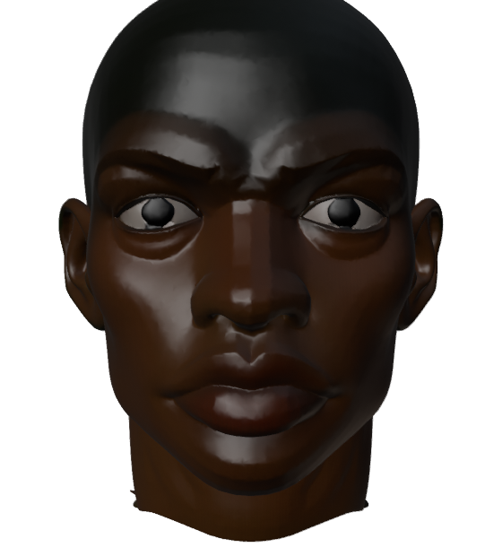

# Rigging: getting bones back into the platform

**Status (updated 2026-09-29, evening):** **Blender 5.1.2 now builds and runs on this aarch64
box**, which was the blocker for everything below — see [the build note](#the-arm64-build-is-done).
Both halves now run here:

| | state |
|---|---|
| character rig (`tools/sf2-probe/rigging/rig_character.py`) | **runs green on Kestrel**: 706 bones, 160 deform, verify ok, pose volume ratios 0.981–0.997 |
| vehicle rig (`tools/rigging/rig_vehicle.py`) | **new, works**: four wheels cut out of a fused reconstruction and given bones, FL/FR/RL/RR |
| the editor's four wheel slots | still never opened on a real asset — now unblocked, since the vehicle rigger produces one |
| lips and eyes | **measured: zero weight on every lip and eye bone.** The defect is real and named below |

The original framing of this document — "no asset has a bone, and characters are blocked on
arm64" — was right about the library and wrong about the blocker.
**Audience:** whoever picks this up next.
**Companions:** [`PLAN-PHYSICS.md`](PLAN-PHYSICS.md) (what the engine does and does not need bones
for), [`PLAN-VEHICLES-ACTORS.md`](PLAN-VEHICLES-ACTORS.md) (the documents a rig feeds).

---

## The measurement that defines the job

```
catalog items                 125
items with a mesh             121
meshes on disk with a skin      0
m1-analogue/mesh.finished.glb   skins: 0   nodes: 1   named: geometry_0
```

Not "the metadata is missing". One node, one mesh, no skeleton — in **every** file. TRELLIS
reconstructs a surface and nothing downstream has ever added a bone to it. So:

- no car's wheels turn;
- no character can be posed, and there are no characters;
- the rig editor in the asset library cannot be opened on a single item, because it appears only
  when `MeshView.rig()` finds bones;
- `wheels.from_rig` was warning on the entire fleet about a file nobody could produce. The physics
  lane has since defaulted it **false everywhere**, which is correct and is explained below.

Reproduce it before you start, because it is the number this whole plan moves:

```bash
node -e 'const fs=require("fs");let n=0,s=0;
for (const d of fs.readdirSync(".local-assets/catalog")) {
  const p=`.local-assets/catalog/${d}/mesh.finished.glb`; if(!fs.existsSync(p))continue;
  const b=fs.readFileSync(p); const j=JSON.parse(b.slice(20,20+b.readUInt32LE(12)).toString());
  n++; if((j.skins||[]).length) s++;
} console.log({meshes:n, withASkin:s})'
```

---

## Two problems wearing one word

They share almost nothing. Do not build one thing.

| | **vehicles** | **characters** |
|---|---|---|
| what a rig is | ~6 bones: four wheels, a steering axis, maybe doors | ~700 bones, a Rigify control rig, ~160 of them deforming |
| how it is made | derived from the mesh — wheels are findable geometry | fitted from a human template, then weighted |
| what it drives | the **visuals** only (see below) | the mesh itself; nothing works without it |
| weighting | none — wheels are rigid children | bone-heat over a watertight cage |
| runs where | anywhere; it is arithmetic on a mesh | Blender ≥ 5.1, amd64 only |
| how wrong shows up | silently: a car that steers with its back wheels | immediately: the arm drags the torso |
| state today | slot editor built, nothing to open it on | script written and proven on one character, offline |

**Vehicles are the cheap half and should go first.** They are also the half Rich is asking about.

### What the physics engine actually needs: nothing

From the physics lane, 2026-09-29, and it reframes the whole vehicle job:

> The engine does not need bones at all. `Vehicle` places four raycast wheels from `wheelbase` and
> `track` and always has; the rig would only ever have driven the VISUAL wheels.

So an unrigged car **is a usable vehicle today** — it drives, it crashes, it has an engine note.
What it does not do is spin or steer its wheel meshes. That is the entire deficit, and it means
vehicle rigging is a **visual-fidelity** feature, not a blocker. Plan it that way: nothing here is
allowed to make an unrigged car less usable than it is now.

---

## What already exists

| thing | where | state |
|---|---|---|
| wheel-slot editor (FL/FR/RL/RR, preview highlight) | `apps/corridor/src/ui/assets.ts`, `rigEditor` | built, unexercised |
| slot inference from bone positions | `apps/corridor/src/rigslots.ts` + `test/rigslots.test.ts` | built, 11 tests |
| bone positions in the model's own frame | `MeshView.bonePlaces()` | built |
| rig detection and role guessing from names | `MeshView.rig()`, `matchRoles` | built |
| `rig` on the catalog record, survives unrelated edits | `tools/assetsvc/catalog.mjs`, probed | built |
| character rigger (Rigify, cage, weight transfer) | `tools/sf2-probe/rigging/rig_character.py` | works, amd64 only |
| its written-up traps | the README beside it, and `git show 7f2ad65:tools/rigging/README.md` | read this first |
| joint-correction viewer | `apps/arcade/public/models.html` (arcade repo) | works on the wrong skeleton — see below |

**`tools/rigging/` was moved, not deleted.** It is at `tools/sf2-probe/rigging/` in the working
tree, uncommitted. Put it back somewhere sensible before building on it; `tools/rigging/` was the
right place.

---

## Stage 1 — derive a wheel rig from the mesh (no Blender, no service)

The whole of vehicle rigging, for a reconstruction, is: **find the four wheels and split them into
their own nodes.** A wheel is the most findable thing on a car — four roughly-cylindrical clusters,
near the ground, at the corners, dark. This is arithmetic over a glb and it can run in Node.

1. **Segment.** Connected components of the mesh, or a clustering of triangles by position. Keep
   components whose bounding box is roughly cubic in the two horizontal axes, sits in the bottom
   third of the model, and is one of exactly four at the corners.
2. **Fit.** Each wheel's centre and its axle direction (the eigenvector of least variance — a wheel
   is a disc, so that is the axle).
3. **Emit.** Four nodes parented under a new root, each holding its component's primitive, with the
   node's translation at the wheel centre, plus `rig.roles.wheel` in FL/FR/RL/RR order via
   `guessWheelSlots`. **Nothing needs skinning** — rigid parenting is what a wheel wants.
4. **Write** the rig onto the catalog record and the new glb beside the old one, as
   `mesh.rigged.glb`. Never overwrite `mesh.finished.glb`; the unrigged one must stay loadable.

**The check that can fail:** load the emitted glb, spin each wheel node 90° about its fitted axle,
and assert the mesh's overall bounding box does not grow by more than a few percent. A wheel
rotating about the wrong axis sweeps a much larger box, and a wheel node that accidentally holds
half the body sweeps an enormous one. Do **not** assert "four nodes exist" — that passes on four
wrong nodes, which is the failure this whole area keeps producing.

Rich's rule from 2026-09-21 applies with full force here: measure, do not type. There is no table
of wheel positions per car that will not be wrong.

### Where it runs
Inside `tools/assetsvc` as a step after `finish.mjs`, so it happens once per asset and every
consumer gets it. A browser-side version would re-do it per page load and per clone.

### What to do when it fails
Say so on the record — `rig: { convention: 'none', why: 'found 3 wheel-like components' }` — and
leave the asset exactly as it is. A car with no wheel rig is a working vehicle. Do not guess at
three wheels and do not fabricate a fourth; `guessWheelSlots` already refuses those cases and the
pipeline should refuse them the same way.

---

## Stage 2 — make the slot editor reachable and correct

It exists and has never run. Once stage 1 produces one rigged asset:

- open it, confirm the four slots fill, confirm clicking a slot lights the right corner;
- confirm **Infer from the model** agrees with what the pipeline wrote — two implementations
  reaching the same answer is the cheapest validation available, and a disagreement is a real bug
  in one of them;
- confirm the swap buttons do what they say by driving the car afterwards, not by reading labels.

Then write `probes/corridor-rig.mjs` against that asset. Until stage 1 lands, that probe has
nothing to open, which is why it does not exist yet.

---

## Stage 3 — turn the visual wheels with the physics wheels

The seam is already described in `PLAN-VEHICLES-ACTORS.md`: the engine owns four raycast wheels
and knows each one's steer angle, spin and suspension travel. Binding is one function:

```
for each slot i in FL FR RL RR:
  node[i].rotation.y = wheel[i].steer      (front only)
  node[i].rotation.x -= wheel[i].spin      (about the FITTED axle, not about X)
  node[i].position.y = rest[i] + wheel[i].travel
```

Two traps, both of which have already bitten this codebase in other forms:

- **Spin is about the axle the fit found, not about a world axis.** Reuse the axle from stage 1;
  do not re-derive it here with a different convention.
- **Sign.** Physics: *"`input.steer` is + for right; a rotation about +Y takes +X toward −Z, which
  is left"* — and their test passed because it asserted `Math.abs(displacement) > 1`. Assert
  **which way** the wheel turns, by name, with the car stationary.

`wheels.from_rig` is the flag that turns this on, and it stays **default false**. It means "this
asset has real wheel nodes to drive"; the validator already reads `if (from_rig && rigWheels < 4)`,
so turning it on for a rigged asset restores a warning that will then mean something.

---

## The arm64 build is done

`.devcontainer/build-blender.sh` builds 5.1.2 from source into a named volume and it is installed:
`/usr/local/bin/blender`. It had been stuck since 2026-09-16 for a reason worth writing down,
because it will happen again: **three object files were 656-byte stubs defining zero symbols**,
truncated by a compile the OOM killer interrupted. `make` treats them as up to date — their mtimes
are newer than their sources — so the final link failed identically forever with undefined
references to `node_deselect_all` and friends. Find them by comparing object size to SOURCE size
(plenty of objects are legitimately tiny), delete the stubs and the `.a` archives holding them, and
re-run. Memory is the job limit, not cores: budget ~2.5 GB per job.

## What is actually wrong with the character rig

Measured on the Kestrel output, freshly regenerated:

| | |
|---|---|
| joint heights vs human proportions | within 0.02 of the Drillis–Contini fractions at every joint. **The fit is good.** |
| pose volume ratios | 0.997 / 0.997 / 0.981 — the cage-and-transfer method works |
| skin joints in the exported .glb | **was 706, now 160** (see below) |
| bones with any weight at all | 73 |
| lip bones with weight | **0** |
| eye bones with weight | **0** |
| brow bones with weight | 2, totalling 45.9 against the jaw's 1,918 |

Rich remembers "her waist joints down by her feet, her legs coming out of her model's feet". That
was real and it is **fixed** — the fork's `fa5dea2` ("read every bone before writing any, or
connected bones transform twice") is exactly the cascade that produces it, and the joints now land
where a human's do. What is left is the face.

**`export_def_bones=True` was missing.** Rigify emits 706 bones and 160 deform; the glTF exporter
defaults to putting EVERY bone in the skin, so the file carried 706 joints of which 633 were dead.
Fixed; the file is 348 KB smaller and every consumer stops allocating 546 useless joint matrices.
This was hard to see because the script's own log said `vertex_groups_on_mesh: 160` — Blender held
160 groups and the exporter wrote 706 joints, and only the first number was printed.

### Lips now move; eyes can only blink — and that is the mesh, not the rig

`face_weights()` in `rig_character.py` computes the face bones' weights on the REAL mesh instead of
inheriting them from the cage: a radial falloff from each bone's segment, taken FROM whatever
already owned the vertex so the total stays 1, capped at 0.85 so the head keeps enough of the skull
to carry it, then smoothed — without the smooth the falloffs meet in a step and the mouth creases
into flat facets when posed.

Measured on Kestrel, by the bones' real names:

| | before | after |
|---|---|---|
| lips (`DEF-lip.*`) | **0 bones, 0 weight** | 4 bones, 12.3 |
| eyelids (`DEF-lid.*`) | 4 bones, 23.3 | 8 bones, 24.1 |
| brows | 2 bones, 45.9 | 12 bones, 65.4 |
| nose and chin | 2 bones, 0.6 | 9 bones, 953 |
| groups carrying any weight | 73 | 100 |
| vertices whose weights do not sum to 1 | 0 | 0 |

**Measure by the bone names, not by the English.** An earlier pass of this reported "eyes: 0" for a
rig whose eyelids were weighted, because nothing in a Rigify face is called "eye" — the lids are
`DEF-lid.*`. The same run reported face weight on `DEF-forearm`, because "ear" is inside "forearm".

### THE ANSWER: reconstruct the HEAD on its own

Rich asked whether running the character through TRELLIS again with an open mouth and eyes, and
fusing the two, would give a rigging target. Fusing will not work and a second pass is not needed
for the eyes — **the budget is the whole problem**, and the fix is a separate head pass.

**Fusing is impossible as stated, and this is measured rather than argued.** Two reconstructions of
the same character in different poses:

```
mesh-arms-clear   48,098 verts   175,131 indices
mesh-arms-in      50,961 verts   177,441 indices
```

No correspondence. A shape key is a per-vertex offset array; it needs the same mesh vertex for
vertex. Two TRELLIS runs give unrelated topology even from one subject, so there is nothing to pair.

**But a head-only pass changes everything.** `ext/kestrel-portrait.png` already has her eyes OPEN;
the body reconstruction closed them because a whole-body pass spends its voxels on the body and the
face gets almost none. Cropping that portrait to the head and reconstructing it alone — 50 seconds
on the cluster's `recon` service, `POST /reconstruct` with one image — gives 252,757 vertices of
head, with **actual eyeballs sitting in sockets** and a clear lip line:



Compare that with the face on the full-body mesh, whose lids are sculpted flat and fused. This is
the single highest-value change available to the character pipeline, and it needs no new art: the
source image is already in the repo.

The eyeballs can then be found automatically, by the same reasoning the wheel fit uses — the ball is
the most protruding thing in the band between the brow and the cheek, so fit a sphere to it and keep
what lies on it. On Kestrel that gives two balls at x = ±0.042, both at z = 0.133, radii within 7%
of each other: symmetric and self-validating, like four wheel radii agreeing.

### What is still unproven, and honestly so

Cutting a ball out and posing it is where the experiment stops being convincing. The separation
tolerance takes sclera and socket along with the iris, so the piece that comes out is bigger than an
eye; the lid deformation is a hand-rolled rotation with no anatomy behind it; and a blink needs the
lid to slide OVER the ball, which is exactly what being welded to it prevents. So: **the geometry to
blink and gaze now exists, and neither has been demonstrated convincingly.** What it would take, in
order:

1. **Tighten the cut.** Fit the sphere, then keep only what is on it AND in front of the socket
   plane, and cap the hole left behind. The wheel separator does the equivalent for a tyre and is
   the model to copy.
2. **Lid bones that are lids.** Two arcs per eye following the lid margin, weighted with a falloff
   along the arc rather than a ball around a point.
3. **Gaze is translation, not rotation, on this mesh.** The iris IS the dark ball, not a mark
   painted on a larger white one, so rotating it about its centre is invisible. Sliding it across
   the sclera reads correctly; a proper eyeball with an iris texture would rotate.

**What the eyes cannot do from the BODY mesh** — which is what the section above supersedes. A
render of that head settles it: on the full-body reconstruction Kestrel's eyes are sculpted SHUT
with the lashes painted on, and there is no eyeball behind them. Lid bones can
squint and approximate a blink; nothing downstream can make an eye look left, because there is no
eye. The same is true of the mouth — the lips are real volumes with a seam and they deform, but
there is no mouth interior, so pushing the lower lip down stretches skin rather than opening a
mouth. Both are assetgen problems: they want a reconstruction that has an eyeball and a parted lip
line, or separate eye geometry added before rigging.

### The older reading of this, kept because the reasoning still applies

Bone-heat runs over the **voxel-remeshed cage**, and at that resolution a cage has no lip seam and
no eye socket — the mouth is one surface and the lids are fused to the eyeball. Heat therefore
cannot separate `lip.T` from `lip.B`, and those bones end up owning nothing. The jaw works because
it is a large volume; the brows barely work because they are a ridge.

Three ways out, cheapest first, and none of them is "raise the voxel resolution" — the cage has to
stay closed, and a finer cage still fuses a closed mouth:

1. **Weight the face from the ORIGINAL mesh, not the cage.** Bone-heat needs a closed surface, but
   the face bones do not need bone-heat: they need a local falloff. Assign lip, lid and brow
   weights by distance to the bone segment on the real geometry, normalised against whatever the
   cage already gave the head. The rest of the body keeps the cage path unchanged.
2. **Shape keys instead of bones** for the face, driven by the same controls. A reconstruction's
   face is a surface, and blendshapes do not care whether it is closed.
3. **Give the reconstruction a mouth.** Neither of the above opens lips that were reconstructed
   sealed — if the source has no lip line, nothing downstream can invent one, and that is an
   assetgen problem rather than a rigging one.

## Stage 4 — characters

Only once stages 1–3 are done, because this one has a hard dependency that nothing else has.

**The blocker: Blender publishes no arm64 build for 5.x.** This devcontainer is `aarch64` and so
are the GH200s. `.devcontainer/build-blender.sh` builds it from source on arm64 — the better part
of an hour, into a named volume — and that path has not been exercised recently. The alternatives,
in the order worth trying:

1. run the rigger on an amd64 box as a batch step and bring the glb back (how Kestrel was made);
2. finish the arm64 source build and keep it in a volume;
3. neither — characters wait.

Then the path is the one the README already describes, and its findings are not negotiable:

- **A reconstruction will not weight until it is watertight.** 315 boundary edges out of 103,000
  were enough to inflate a limb's volume **thirty-fold** when posed. "Mostly closed" is not a
  thing. Remesh to a watertight cage, weight the cage, transfer the weights, delete the cage.
- **Symmetrise the cage, never the mesh** — the rig comes out symmetric and the asset keeps its
  asymmetric costume.
- **Rigify limbs are IK-driven**, so FK rotations render identically to rest until `IK_FK` is 1.0.
  Three renders came back byte-identical before anyone noticed.
- **The glTF importer rotates Z-up to Y-up**, and Rigify's metarig fit reads the bounding box.

### The seam that is still open
Two joint formats exist and they are not the same file:

| format | written by | describes |
|---|---|---|
| `apex-metarig-joints/1` | `rig_character.py --export-joints` | 27 **metarig** bones — the input that controls the rig |
| `apex-joint-offsets/1` | the arcade model viewer's Export | ~160 generated `DEF-` bones — an **output** |

The viewer edits the wrong skeleton. The remaining work is on the viewer side: load
`apex-metarig-joints/1` beside the mesh, edit those 27 joints, write the same format back. The
picking, dragging and box-select all stay. If the rig editor in *this* repo grows a character mode,
it should read that format from the start rather than repeating the mistake.

---

## What not to do

- **Do not classify geometry by colour.** Glass cost four rounds here on exactly that mistake, and
  wheels are darker-than-average in the same unreliable way. Use position and shape.
- **Do not hard-code an axis convention.** A glb carries whatever the exporter wrote; `rigslots.ts`
  has the argument and the tests, including a −Z-forward car that a `+X` reading gets backwards.
- **Do not make the unrigged path worse.** 121 assets are unrigged and will be for a while. Every
  one of them must keep loading, placing and driving exactly as it does now.
- **Do not assert existence.** Four bones, three findings in one evening from the physics lane, and
  every stale probe in this repo say the same thing: assert the mechanism and the direction, and
  prove the new check can fail before you trust it.
